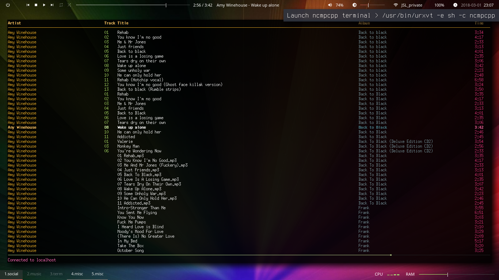
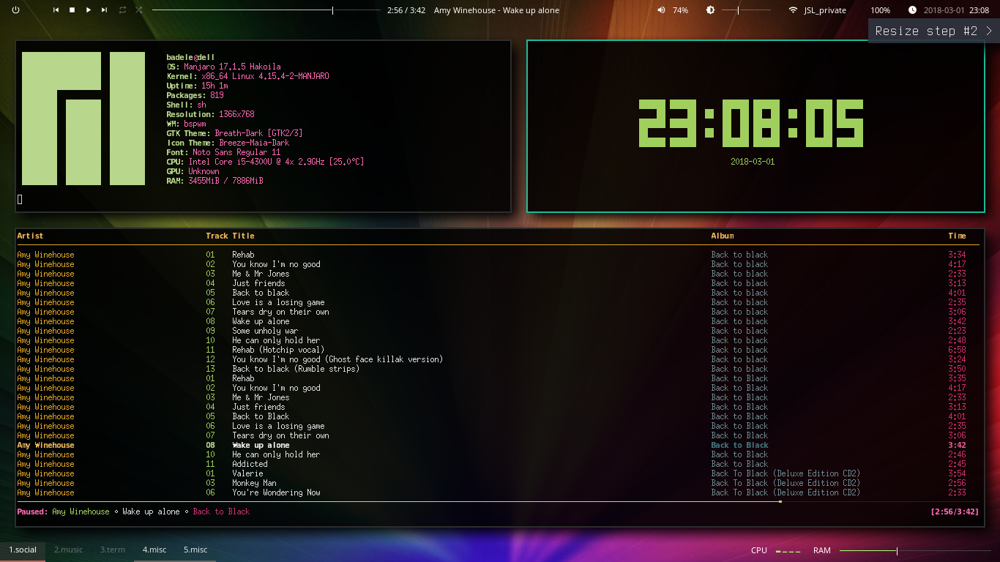
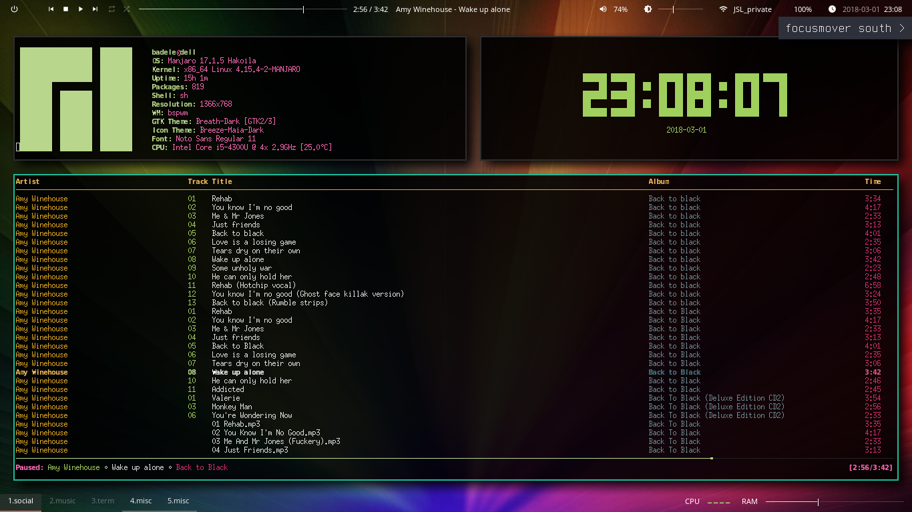

## bspwm-doc

The documentation generator for bspwm project

### Window-Node #1.md

| Description  | Command | Screenshot |
| ----- | ---- | ---- |
| Initial |  |   |
| Window creation(Launch ncmpcpp) | /usr/bin/urxvt -e sh -c ncmpcpp |   |
| North Window preselection | bspc node -p north |   |
| Launch screenfetch | /usr/bin/urxvt -e sh -c screenfetch |   |

### Window-Node #2.md

| Description  | Command | Screenshot |
| ----- | ---- | ---- |
| Initial |  |   |
| east presel | bspc node -p east |   |
| Launch tty-clock | /usr/bin/urxvt -e sh -c tty-clock |   |
| Resize step #1 | bspwm_resize.sh north 50 |   |
| Resize step #2 | bspwm_resize.sh north 50 |   |
| Resize step #3 | bspwm_resize.sh north 50 |   |

### Window-Node #3.md

| Description  | Command | Screenshot |
| ----- | ---- | ---- |
| Initial |  |   |
| south windows focus | focusmover south |   |
| windows ghost presel | bspc node -p east -i |   |

Generated by [bspwm-doc](https://github.com/badele/bspwm-doc)
