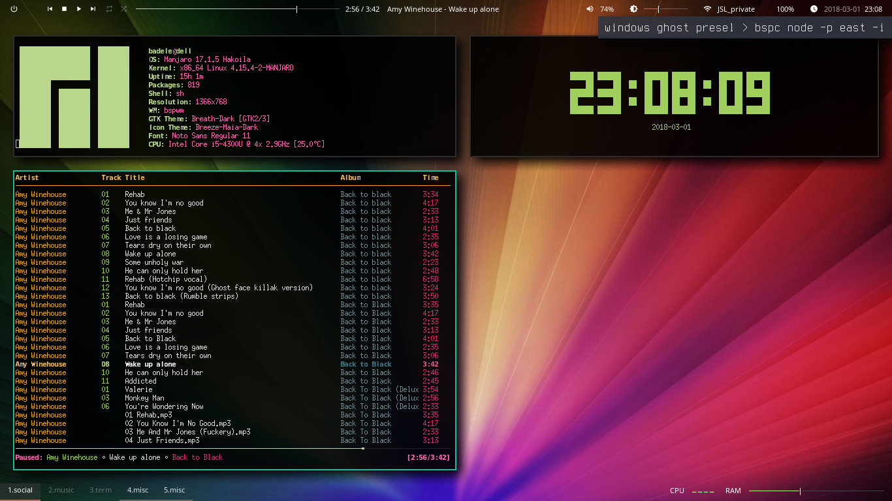

| Description  | Command | Screenshot |
| ----- | ---- | ---- |
| Initial |  |   |
| Window creation(Launch ncmpcpp) | /usr/bin/urxvt -e sh -c ncmpcpp |   |
| North Window preselection | bspc node -p north |   |
| Launch screenfetch | /usr/bin/urxvt -e sh -c screenfetch |   |
